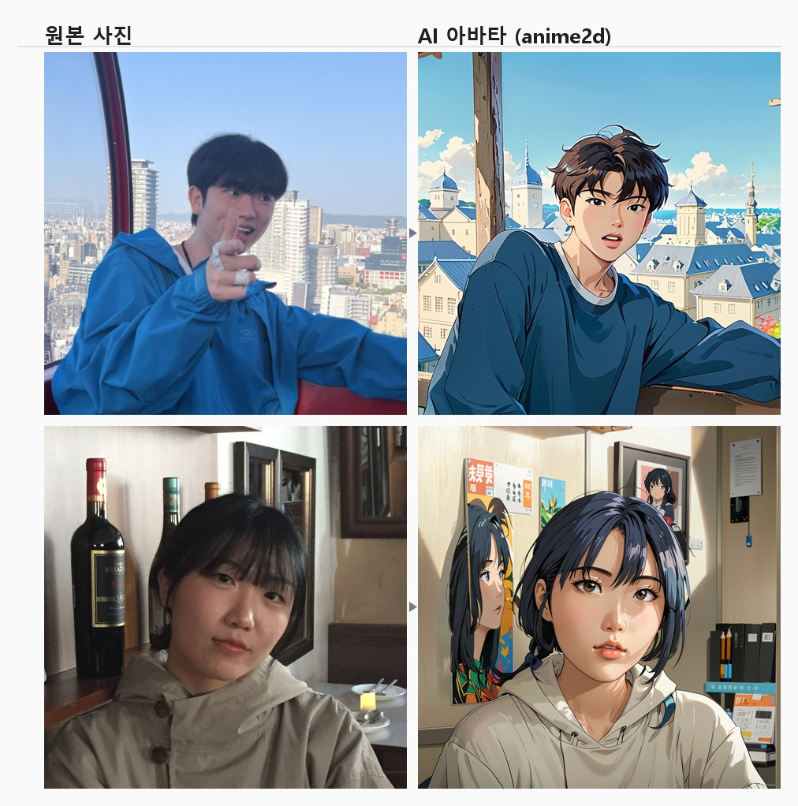

# Blind Dating

### 성향 기반 블라인드 소개팅 서비스

AI 스타일 아바타로 얼굴을 가리고, 설문 응답의 **가중 유사도**로 사람을 연결하는 웹 서비스입니다.

| | |
|---|---|
| **기간** | 2026.05.22 ~ 06.26 (5주) · 이후 AI 서버 문서화·리팩터링 |
| **인원** | 2명 — 본인(Backend · AI/GPU 파이프라인 · 통합) / 팀원 1명(Frontend UI) |
| **기여** | 전체 24커밋 중 **21커밋** · `backend/`·`ai/` 전량 + 프론트–백엔드 연동 |
| **구성** | Vue 3 SPA · Django 6 (REST + WebSocket) · Linux GPU 추론 서버 |

> 📌 **이 프로젝트의 핵심 3가지**
>
> 1. **인프라 제약이 아키텍처를 결정했습니다.** GPU 예산이 없어 사설망 머신을 써야 하는 상황에서 호출 방향을 뒤집어(pull), 인바운드 포트 개방 없이 동작하고 GPU가 꺼져도 웹 서비스가 살아 있는 구조를 만들었습니다.
> 2. **도구를 추가하지 않은 것도 설계입니다.** Celery + 브로커 대신 DB 테이블 하나를 작업 큐로 사용해 5주 일정의 운영 복잡도를 늘리지 않았고, **그 대가(복수 워커 시 원자적 선점 부재)를 문서로 남겼습니다.**
> 3. **대기 시간은 줄이는 것 외에도 다루는 방법이 있습니다.** 수십 초의 추론 대기를 필수 설문 21문항과 겹쳐 배치해 체감 대기를 사실상 0으로 만들었습니다.

---

## 1. 무엇을 만들었나

외모나 스펙이 아니라 **성향**으로 사람을 연결하는 소개팅 서비스입니다.

사용자는 `넷플릭스 vs 유튜브`, `아침형 vs 저녁형` 같은 A/B 질문 21개에 답하고, 서버는 질문별 가중치와 성향 유형을 반영해 **0~100점의 궁합 점수**를 계산해 상대를 추천합니다.

여기에 **블라인드**를 실제로 구현하기 위해, 얼굴 사진을 그대로 노출하지 않고 **업로드한 사진을 AI 스타일 아바타로 변환해 프로필로 사용**합니다. 이 아바타 생성을 위해 별도의 **Linux GPU 추론 서버**를 구축했습니다.

### 변환 결과



**구도·포즈·의상 색이 그대로 남아 있는 것**이 이 파이프라인의 목표였습니다. `denoise 0.6`으로 부분만 디노이즈해 "이게 내 사진"이라는 감각을 유지하면서 화풍만 바꿉니다. `denoise 1.0`(txt2img)이면 완전히 다른 사람이 나옵니다.

> 샘플 사진은 **본인과 팀원의 동의를 받아** 실었습니다. 서비스 사용자의 사진은 포함돼 있지 않습니다.

---

## 2. 시스템 아키텍처

3개의 독립 배포 단위로 분리하고, 그 사이를 **DB 기반 작업 큐**로 느슨하게 연결했습니다.

```
┌──────────────┐   REST + WebSocket    ┌────────────────────────────────┐
│  Vue 3 SPA   │◀─────────────────────▶│  Django 6 (ASGI / Daphne)      │
│  Vite/Pinia  │   JWT / ?token=       │  DRF · Channels · Redis        │
└──────────────┘                       │  AIJob 테이블 = 비동기 작업 큐  │
                                       └────┬──────────────────┬────────┘
                                            │                  │
                        ① GET  /ai/next-job/│    작업 선점       │ boto3
                        ② POST /ai/complete-upload/  결과 전송   ▼
                                            │            ┌──────────┐
                                            │            │  AWS S3  │
                                  ┌─────────▼─────────┐  │ originals│
                                  │  GPU Server       │  │ generated│
                                  │  (Linux · CUDA)   │  └──────────┘
                                  │                   │
                                  │  worker.py  폴링   │
                                  │  main.py    FastAPI│  /health /config
                                  │      ↓             │
                                  │  ComfyUI HTTP API  │
                                  │  SDXL · LoRA ·     │
                                  │  IPAdapter FaceID ·│
                                  │  FaceDetailer ·    │
                                  │  Ultimate SD Upscale
                                  └───────────────────┘
                                    (outbound only — 인바운드 포트 없음)
```

### 작업 상태 흐름

```
사용자 업로드          워커 선점              워커 완료 통보
─────────────▶ pending ────────▶ processing ────────▶ done
                                     │
                                     └─ 예외 / 타임아웃 ─▶ failed (+ error_message)
```

---

## 3. 핵심 설계 ① — GPU 서버가 Django를 폴링한다 (pull)

이미지 1장 생성에 수십 초가 걸리므로 Django 요청–응답 안에서 처리할 수 없고, 웹 서버에 CUDA와 모델 수십 GB를 올릴 수도 없었습니다. GPU 서버를 독립 배포 단위로 분리하되 **호출 방향을 뒤집었습니다.**

| | push (Django → GPU) | **pull (GPU → Django)** ← 채택 |
|---|---|---|
| 응답 지연 | HTTP 타임아웃 발생 | 즉시 `job_id` 반환, 결과는 비동기 |
| 네트워크 | GPU 서버에 인바운드 포트 개방 필요 | **outbound only** — 사설망·유동 IP에서도 동작 |
| 장애 내성 | GPU 다운 시 요청 유실 | 작업이 DB에 `pending`으로 잔존 |
| 확장 | 로드밸런서 필요 | 워커 프로세스 추가만으로 확장 |

개발 단계에서 GPU 머신이 **개인 사설망에 있었기 때문에**, push 방식은 고정 IP나 포트포워딩 없이는 성립하지 않았습니다. pull로 뒤집자 GPU 서버 쪽 네트워크 설정이 전혀 필요 없어졌고, GPU가 꺼져 있어도 웹 서비스는 정상 동작하며 작업만 큐에 쌓입니다.

### 왜 Celery를 쓰지 않았나

브로커(Celery + RabbitMQ)를 추가하지 않고 **기존 DB 테이블을 큐로 사용**한 것은, 5주 일정에서 운영 복잡도를 늘리지 않기 위한 의도적 선택입니다. FIFO(`ordering = ['created_at']`) · 상태 머신 · 실패 사유 전달이라는 당시 요구사항은 테이블 하나로 충족됐습니다.

**대신 포기한 것이 무엇인지 알고 있습니다** — 작업 선점이 원자적이지 않아 워커가 2대 이상이면 중복 처리가 가능합니다. 개선 방향(`select_for_update(skip_locked=True)`)까지 [9. 알려진 한계](#9-알려진-한계와-개선-계획)에 적어두었습니다.

### Django ↔ 워커 API 계약

| # | 메서드 | 엔드포인트 | 내용 |
|---|---|---|---|
| ① | `GET` | `/api/accounts/ai/next-job/` | 대기 작업 1건 선점 → 즉시 `processing` 전환 |
| ② | `POST` | `/api/accounts/ai/complete-upload/` | `multipart`로 결과 이미지 전송 → **Django가 S3 업로드** |
| ②' | `POST` | `/api/accounts/ai/complete/` | 실패 통보 (`error_message` 기록) |

②에서 워커가 S3에 직접 올리지 않고 백엔드에 파일을 넘기는 것은, **GPU 서버에 AWS 자격증명을 두지 않기 위한 선택**입니다. 자격증명의 보관 지점을 하나로 줄였습니다.

---

## 4. 핵심 설계 ② — 수십 초의 대기를 UX로 흡수

비동기로 바꿔도 사용자는 결국 기다립니다. 그래서 **대기 구간에, 어차피 반드시 거쳐야 하는 절차를 겹쳐 배치**했습니다.

> "이미지 생성 중이에요 → 기다리는 동안 간단한 질문들을 준비했어요"

이미지가 GPU에서 생성되는 동안 사용자는 매칭 설문 21문항을 풉니다. 설문은 서비스 이용에 **필수인 단계**이므로 체감 대기 시간이 사실상 0이 됩니다. 프론트는 3초 간격으로 `/ai/status/{job_id}/`를 폴링하고, 다음 화면(`MyAvatarView`)에서도 이어서 폴링해 늦게 완료된 이미지를 회수합니다.

여기에 **폴백 타임아웃**을 넣어, GPU 워커가 꺼져 있는 환경(팀원 로컬, 발표 시연)에서도 약 10.8초 후 다음 화면으로 진행되게 했습니다. AI 서버 가동 여부와 무관하게 전체 플로우 시연이 가능합니다.

---

## 5. ComfyUI 추론 파이프라인

> 사용한 모델은 **전부 공개 사전학습 모델**이며 파인튜닝은 하지 않았습니다.
> 작업 내용은 **체크포인트·LoRA·IPAdapter·업스케일러를 비교하고 조합해 하나의 추론 파이프라인으로 연결한 것**입니다.
> 가중치 총합 약 69GB는 저장소에 포함하지 않고, `ai/models/manifest.json` + `ai/scripts/download_models.py`로 환경을 재구성할 수 있게 했습니다.

```
LoadImage(원본)
 ├─ IPAdapterUnifiedLoaderFaceID   FACEID PLUS V2, lora_strength 0.85, provider CUDA
 └─ VAEEncode
        ▼
CheckpointLoaderSimple   dreamshaperXL_lightningDPMSDE (SDXL Lightning)
   → LoraLoader          giblylast.safetensors  0.8 / 0.8
   → IPAdapterFaceID     weight 0.65, linear, concat, embeds_scaling "V only"
   → KSampler            steps 25, cfg 6, dpmpp_2m_sde / karras, denoise 0.6   ← img2img
   → VAEDecode
   → FaceDetailer        face_yolov8m + SAM(vit_b), guide 768, denoise 0.3     ← 얼굴 복원
   → UltimateSDUpscale   4x-UltraSharp, ×1.2, denoise 0.15, tile 768           ← 디테일 보정
   → SaveImage (node 42)
```

| 스타일 | 베이스 | LoRA | IPAdapter weight | LoRA strength | 의도 |
|---|---|---|---|---|---|
| `ghibli` | DreamShaper XL Lightning | `giblylast` 0.8 | 0.65 | 0.85 | 화풍 강하게 / 정체성 약하게 |
| `anime2d` | DreamShaper XL Lightning | `giblylast` 0.7 | 0.75 | 0.6 | 정체성 강하게 / 화풍 약하게 |

### 파라미터를 그렇게 정한 이유

| 결정 | 근거 |
|---|---|
| txt2img 대신 **img2img (denoise 0.6)** | txt2img는 원본의 구도·포즈·상반신 구성이 사라져 "내 사진"이라는 느낌이 없어집니다. 구도는 유지하고 화풍만 바꾸기 위해 부분 디노이즈를 선택했습니다 |
| 베이스를 **Juggernaut-XL v9 → DreamShaper XL Lightning** | Juggernaut는 정체성 유지에 유리했으나 생성 시간이 길었습니다. 사용자 대기 시간을 줄이기 위해 저스텝 계열로 교체했습니다 (초기 그래프는 `ai/workflows/ui/`에 보존) |
| **IPAdapter weight와 LoRA weight를 분리 튜닝** | 정체성(IPAdapter)과 스타일(LoRA)이 같은 샘플링에서 서로 상쇄됩니다. 스타일마다 두 값의 균형점이 달라 개별 튜닝했습니다 |
| IPAdapter provider를 **CPU → CUDA** | 초기 CPU 설정에서 InsightFace 임베딩 추출이 병목이었습니다 |
| **FaceDetailer** 추가 (denoise 0.3) | 전신·상반신 사진은 얼굴에 할당되는 latent 해상도가 부족해 눈·입이 뭉개집니다 → 얼굴만 crop해 고해상도로 재생성한 뒤 SAM 마스크로 합성. 재생성 denoise를 0.3으로 억제해 인물이 바뀌는 것을 방지했습니다 |
| 4x 업스케일러를 **×1.2 / denoise 0.15**로 제한 | 업스케일 단계의 디노이즈는 사실상 재생성이라 얼굴 인상이 변합니다. 역할을 "디테일 보정"으로 한정하고 타일 경계는 `mask_blur 8` · `tile_padding 32`로 처리했습니다 |
| 네거티브에 `photorealistic, 3d, CGI` 명시 | 실사로 회귀하는 현상을 억제했습니다. `old, beard, mustache, closed eyes`로 프로필 사진에 부적합한 변형을 차단했습니다 |

### 모델 선정 과정

스타일 재현도를 직접 비교해 조합을 확정했습니다.

- **체크포인트 13종** 비교 (약 59GB) → 운영 `dreamshaperXL_lightningDPMSDE`(SDXL), 실험 2단계 `meinamix_v12Final`(SD1.5)
- **지브리 LoRA 4종** A/B 비교 → `giblylast` 채택
  - `Ghibli_xl_v2` — 스타일 강도는 높으나 얼굴 왜곡 발생
  - `ghibli_style_offset` — 변환 강도 부족
- 정체성 유지 — `IP-Adapter FaceID Plus V2 (SDXL)` + `InsightFace buffalo_l`
- 얼굴 검출·세그멘테이션 — `face_yolov8m.pt` + `sam_vit_b` / 업스케일 — `4x-UltraSharp`

### 실험 파이프라인 — 2 스테이지 모델 체이닝 (검증 완료, 미배포)

```
[Stage 1]  SDXL   dreamshaperXL_lightning + IPAdapterFaceID(0.7)
           KSampler steps 30, cfg 5, denoise 0.35 → FaceDetailer → Upscale ×1.2
           → 얼굴 정체성 확립
                    │  VAEDecode (픽셀 공간 경유)
                    ▼
[Stage 2]  SD1.5  meinamix_v12Final + LoRA thickline_fp16(0.6)
           VAEEncode → KSampler steps 25, cfg 7, denoise 0.45
           → 화풍 확립
```

SDXL은 IPAdapter FaceID 지원으로 얼굴 정체성 보존이 강하지만, 2D 애니 화풍 LoRA 생태계는 SD1.5가 훨씬 풍부합니다. 하나의 그래프로 두 요구를 동시에 만족시킬 수 없어 역할을 분리했고, 아키텍처가 달라 latent를 직접 넘길 수 없으므로 **`VAEDecode` → `VAEEncode`로 픽셀 공간을 경유해 연결**했습니다.

품질은 더 좋았지만 **생성 시간이 약 2배로 늘어 사용자 대기를 감당할 수 없다고 판단해 운영에 반영하지 않았습니다.** 구현·검증은 완료해 `ai/workflows/experimental/`에 보존했습니다.

전체 설계 근거·파라미터·모델 비교 👉 **[`ai/README.md`](ai/README.md)** · **[`ai/docs/MODELS.md`](ai/docs/MODELS.md)**

---

## 6. 워커 구현에서 부딪힌 문제들

### 6-1. 서로 다른 사용자에게 같은 이미지가 나갔습니다

ComfyUI는 동일한 prompt 그래프를 **history 캐시**로 판단해 이전 결과를 그대로 반환합니다. 워크플로우 JSON에 저장된 seed를 그대로 쓰면 모든 사용자가 같은 이미지를 받습니다.

```python
for node in workflow.values():
    if "seed" in node.get("inputs", {}):
        node["inputs"]["seed"] = random.randint(1, 2**32 - 1)
```

특정 노드가 아니라 **그래프 전체를 순회해 모든 seed 노드를 랜덤화**했습니다. 그래프에는 KSampler · FaceDetailer · UltimateSDUpscale 세 곳에 seed가 있어, 하나만 바꾸면 캐시가 계속 걸립니다.

### 6-2. UI 포맷 JSON은 `/prompt`가 받지 않습니다

ComfyUI 화면에서 저장한 JSON(`nodes` 배열 + `links`)과 API가 요구하는 포맷(노드 ID를 키로 갖는 dict)이 다릅니다. **Save (API Format)** 으로 내보낸 것만 사용할 수 있습니다.

```
ai/workflows/*.json        ← API 포맷 (워커가 실제로 로드)
ai/workflows/ui/*.json     ← UI 포맷 (화면 편집·비교용, 워커 미사용)
```

### 6-3. 노드 번호 하드코딩을 걷어냈습니다

워커는 특정 노드에 입력을 주입하고 특정 노드에서 결과를 꺼냅니다. 그래프를 수정하면 노드 번호가 바뀌므로 설정으로 분리했습니다.

```python
WORKFLOW_CONFIG = {
    "ghibli": {
        "file": "ghibli.json",
        "load_image_node": "10",       # LoadImage      → 입력 파일명 주입
        "positive_prompt_node": "18",  # CLIPTextEncode → 성별 프롬프트 보강
        "save_image_node": "42",       # SaveImage      → 결과 추출
    },
}
```

### 6-4. 무한 대기를 막았습니다

`/history/{prompt_id}` 폴링을 조건 없는 `while True`로 두면, ComfyUI가 죽거나 그래프 검증에 실패했을 때 **워커가 영구히 멈추고 job도 `processing`에 잔류**합니다.

- `GENERATE_TIMEOUT`(기본 600초) 초과 시 `TimeoutError`
- ComfyUI가 `status_str == "error"`를 반환하면 즉시 예외로 전환
- 어떤 예외가 나든 `except Exception`으로 받아 `/ai/complete/`로 실패를 통보 → **job이 `processing`에 방치되지 않음**
- 폴링 자체가 실패하면 `ERROR_BACKOFF`(5초) 후 재시도해 루프가 죽지 않게 처리

### 6-5. 기본값이 만든 조용한 버그

성별에 따라 프롬프트에 `1girl` / `1boy`를 덧붙이는 로직에서, 초기 구현은 gender 기본값을 `'M'`으로 뒀습니다. 백엔드가 gender를 내려주지 않으면 **모든 사용자에게 `1boy`가 붙는** 문제가 있었습니다.

```python
if node_id not in workflow or gender not in ("M", "F"):
    return
```

**"모르면 기본값을 넣는다"가 아니라 "모르면 아무것도 하지 않는다"** 로 바꾼 것입니다.

### 6-6. FastAPI를 둔 이유

작업 수신은 어디까지나 pull 방식이므로 FastAPI가 작업을 받지는 않습니다. **GPU 서버의 생존 상태를 외부에서 확인**하기 위해 뒀습니다.

```python
@app.get("/health")     # worker_alive + comfyui_reachable + uptime
@app.get("/config")     # 로드된 스타일 매핑 (시크릿 미노출)
```

워커 루프는 백그라운드 스레드로 실행하고, `/health`는 **워커 스레드 생존 여부와 ComfyUI 연결 상태를 함께** 확인해 `ok` / `degraded`를 반환합니다. 워커만 살아 있고 ComfyUI가 죽은 상태를 구분할 수 있어야 했기 때문입니다.

---

## 7. 백엔드 주요 구현

### 7-1. 가중 유사도 매칭 알고리즘

단순 일치율이 아니라, **질문의 성격에 따라 점수 부호를 뒤집어** 궁합을 계산합니다. 질문마다 `match_type`(similar / complement / neutral)과 `weight`(0.3~1.2)를 부여했습니다.

```python
same = (a_answers[qid] == b_answers[qid])
base_sim = 1.0 if same else 0.0
if q.match_type == 'complement':
    sim = 1.0 - base_sim          # 다를수록 좋은 질문은 점수를 반전
else:
    sim = base_sim

weight = q.weight
if both_complement and q.match_type == 'complement':
    weight *= 1.5                 # 양쪽 모두 '다른 사람' 선호 → 보완 질문 증폭

return round(match_score / total_weight * 100, 1)   # 0~100 정규화
```

- **같아야 좋은 질문과 달라야 좋은 질문을 구분**했습니다. `아침형 vs 저녁형`은 생활 패턴이라 같아야 좋으므로 `similar, 1.2`로, `전화 vs 카톡`(연락 방식)과 `게임 vs 운동`(취미)은 보완되는 편이 낫다고 판단해 `complement`로 지정했습니다.
- **재미 요소는 가중치를 낮췄습니다** — `부먹 vs 찍먹` 0.5, `붕어빵 머리 vs 꼬리` 0.3. 매칭 정확도를 해치지 않으면서 설문 이탈률을 낮추는 장치입니다.
- **공통 응답 문항만으로 정규화**해, 설문을 다 풀지 않은 사용자도 비교할 수 있습니다.
- 사용자의 `match_preference`를 반영하되, **양쪽 모두 '다른 사람'을 선호할 때만** 보완 가중치를 증폭했습니다.

### 7-2. WebSocket 실시간 채팅 — JWT 인증 미들웨어 직접 구현

브라우저 WebSocket API는 커스텀 헤더를 지정할 수 없어, REST와 같은 `Authorization: Bearer` 방식을 쓸 수 없었습니다. Channels `BaseMiddleware`를 상속해 **쿼리스트링의 JWT를 검증하고 `scope['user']`에 주입**하는 미들웨어를 구현했습니다.

연결 수립 단계에서 인가를 세 겹으로 검증합니다.

```python
if self.user.is_anonymous:         await self.close()   # ① 익명 차단
if not await self.is_participant(): await self.close()  # ② 채팅방 당사자 + ③ 결제 완료
```

`is_participant()`는 당사자 여부와 함께 **`match.is_chat_open`(양측 결제 완료)까지 검증**합니다. 결제하지 않은 사용자가 REST를 우회해 소켓으로 접속하는 경로를 막았습니다. 동기 ORM 호출은 `database_sync_to_async`로 래핑했습니다.

### 7-3. 쿼리 최적화

추천 목록을 만들 때 사용자마다 `AIJob`을 조회하면 N+1이 발생합니다. 후보 ID를 모아 한 번에 조회한 뒤 사용자별 최신 완료 작업만 매핑했습니다. 질문 데이터도 `question_cache`로 한 번만 조회해 유사도 계산 루프 내내 재사용합니다.

```python
ai_jobs = AIJob.objects.filter(user_id__in=candidate_ids, status='done').order_by('-created_at')
question_cache = {q.id: q for q in Question.objects.all()}
```

### 7-4. 결제 서버 검증

결제는 PortOne을 통해 **카카오페이**로 받습니다. 클라이언트의 "결제 성공" 신호를 신뢰하지 않고, 서버가 PortOne 토큰을 발급받아 `api.iamport.kr/payments/{imp_uid}`로 실제 상태를 재조회합니다. `imp_uid`에 `unique` 제약 + `get_or_create`로 중복 반영을 막았습니다.

**양측이 모두 결제해야 `is_chat_open=True`가 됩니다.** 한쪽만 관심 있는 매칭을 걸러내 "진정성 있는 만남"을 만들려는 제품 의도이자, 동시에 인가 조건이기도 합니다. 이 플래그는 **REST와 WebSocket 양쪽에서 재검증**됩니다.

---

## 8. 기술 스택

| 영역 | 스택 |
|---|---|
| **Backend** | Python · Django 6.0.6 · DRF 3.17.1 · SimpleJWT 5.5.1 · Django Channels 4.3.2 · channels-redis · Daphne(ASGI) · Redis · SQLite3 · boto3 |
| **AI / GPU** | FastAPI 0.115 · Uvicorn · ComfyUI HTTP API · PyTorch/CUDA · Stable Diffusion XL · SD 1.5 · LoRA · IP-Adapter FaceID Plus V2 · InsightFace buffalo_l · Ultralytics YOLOv8 · SAM · Ultimate SD Upscale |
| **Frontend** | Vue 3 · Pinia · Vue Router · Axios · Vite |
| **Infra / 외부** | AWS S3 · Linux GPU 서버 · 터널링(개발 단계) · PortOne 결제 |

### 프로젝트 구조

```text
blind_dating
│
├── backend                  Django (REST + WebSocket)
│   ├── accounts             인증 · 프로필 · AI 작업 큐
│   ├── matching             질문/답변 · 매칭 · 채팅 · 결제
│   ├── config               settings / asgi / urls
│   └── requirements.txt
│
├── ai                       GPU 추론 서버 (폴링 워커 + ComfyUI)
│   ├── README.md            아키텍처 · 파이프라인 · 설계 근거
│   ├── app                  worker.py(폴링 루프) · config.py · main.py(FastAPI /health)
│   ├── workflows            ComfyUI 워크플로우 JSON (운영 / 실험 / UI 편집용)
│   ├── models/manifest.json 모델 목록 (가중치는 미포함)
│   ├── scripts              모델 다운로드 · 파이프라인 단독 검증
│   └── docs                 MODELS.md · 변환 전후 샘플 이미지
│
└── frontend                 Vue 3 SPA
```

---

## 9. 알려진 한계와 개선 계획

설계 당시의 판단과 **그 대가를 함께** 기록했습니다.

| 한계 | 원인 | 개선 방향 |
|---|---|---|
| 작업 선점이 비원자적 (`filter().first()` → `save()`) → 워커 2대 이상이면 중복 처리 가능 | 단일 워커 전제 | `select_for_update(skip_locked=True)` 트랜잭션, 또는 Celery + Redis 브로커 |
| Django 워커 엔드포인트가 `AllowAny` | 5주 일정상 후순위 | 워커는 이미 `X-Worker-Token`을 전송 중 — **백엔드 측 검증 추가만 남음** |
| 백엔드가 `gender`를 내려주지 않아 성별 프롬프트 보강이 사실상 비활성 | 워커 계약이 나중에 확장됨 | `NextJobAPIView` 응답에 `user.gender` 추가 |
| `pixar`·`zepeto`는 `STYLE_CHOICES`에만 있고 전용 워크플로우 미구현 | 시간 부족 | 워크플로우 추가 (현재는 기본 스타일로 대체되며 로그로 남김) |
| 유저·워커 양쪽 폴링으로 불필요한 요청 발생 | 구현 단순성 우선 | **이미 Channels/Redis가 있으므로** WebSocket 푸시 또는 SSE로 전환 |
| 워커가 처리 중 죽으면 job이 `processing`에 잔류 | 워커 측 타임아웃만 구현 | 백엔드에 `updated_at` 기반 stale job 재큐잉 |
| 결제 검증에 시연용 폴백이 남아 있음 (PortOne 조회 실패 시 `imp_uid` 존재만으로 인정), 금액도 하드코딩 | 발표 중 결제 API 실패로 플로우가 끊기는 것을 막기 위한 임시 조치 | 폴백 제거, PortOne 응답 `amount`를 서버 기준가와 대조 |
| 2-스테이지 파이프라인 품질은 우수하나 생성 시간 2배 | 아키텍처가 다른 두 모델 체이닝 | 유료 옵션으로 분리하거나 저스텝 스케줄러로 단축 |
| SQLite 단일 인스턴스, 개발 설정(`ALLOWED_HOSTS=["*"]`) | 개발·시연 단계 | PostgreSQL 전환, 배포 설정 분리 |
| 채팅 토큰이 쿼리스트링에 노출 | 브라우저 WebSocket API 제약 | 단기 1회용 티켓 토큰 교환 방식 |
| 생성 이미지의 톤이 입력 사진마다 제각각 | 색상 팔레트를 고정하지 않음 | 서비스 팔레트를 정해 프롬프트·LoRA에 반영 — 프로필이 나란히 놓였을 때 컨셉이 일관됩니다 |

---

## 10. 실행 방법

### Backend

```bash
cd backend
pip install -r requirements.txt
cp .env.example .env              # SECRET_KEY, AWS_*, PORTONE_* 설정

python manage.py migrate
python manage.py seed_questions   # 질문 시딩
daphne -b 0.0.0.0 -p 8000 config.asgi:application
```

> Redis가 실행되어 있어야 채팅이 동작합니다 — `docker run -p 6379:6379 redis`

### Frontend

```bash
cd frontend
npm install
npm run dev
```

### AI GPU Server

```bash
cd ai
pip install -r requirements.txt
python scripts/download_models.py --comfy-root /opt/ComfyUI
cp .env.example .env              # BACKEND_URL, COMFYUI_URL 설정

python -m app.worker                              # 워커만 실행
uvicorn app.main:app --host 0.0.0.0 --port 8000   # FastAPI 래퍼(/health)와 함께
```

자세한 설치·설정은 [`ai/README.md`](ai/README.md) 참고.

### 주요 API

| 메서드 | 엔드포인트 | 설명 |
|---|---|---|
| `POST` | `/api/accounts/signup/` · `login/` · `login/refresh/` | 회원가입 · 로그인 · 토큰 재발급 |
| `POST` | `/api/accounts/ai/create/` | 사진 업로드 + 스타일 선택 → 작업 등록 (즉시 `job_id` 반환) |
| `GET` | `/api/accounts/ai/status/<job_id>/` | 작업 상태 조회 (폴링) |
| `GET` | `/api/matching/questions/` · `POST /answers/` | 질문 목록 · 답변 제출 |
| `GET` | `/api/matching/matches/recommend/` | 추천 상대 목록 |
| `POST` | `/api/matching/friend-request/send/` · `respond/` | 친구 요청 · 수락/거절 |
| `POST` | `/api/matching/payment/verify/` | 결제 서버 검증 |
| `WS` | `/ws/chat/<match_id>/?token=<JWT>` | 실시간 채팅 |

---

## 11. 회고 — 이 프로젝트에서 남은 것

**첫째, 인프라 제약이 아키텍처를 결정한다는 것입니다.**
GPU 예산이 없어 사설망 머신을 써야 했고, 그 제약 때문에 호출 방향을 뒤집었습니다. 결과적으로 얻은 장애 내성과 수평 확장성은 처음부터 의도한 것이 아니라 **제약을 정면으로 받아들인 데서** 나왔습니다. "이상적인 구조"가 아니라 "지금 조건에서 성립하는 구조"를 먼저 찾는 편이 낫다는 것을 배웠습니다.

**둘째, 도구를 추가하지 않는 것도 설계라는 것입니다.**
Celery를 붙이는 선택지가 있었지만, 5주 일정에서 브로커 하나를 더 운영하는 비용이 얻는 것보다 컸습니다. 다만 그 대가로 원자적 선점을 포기했다는 점을 알고 있고, 워커를 늘리는 순간 무엇을 먼저 고쳐야 하는지도 명확합니다.

**셋째, 생성 모델은 파라미터가 곧 제품 결정이라는 것입니다.**
denoise를 0.6으로 두느냐 1.0으로 두느냐는 하이퍼파라미터 조정이 아니라 **"이게 내 사진인가"를 결정하는 문제**였습니다. 업스케일의 denoise를 0.15로 억제한 것, FaceDetailer의 denoise를 0.3으로 묶은 것 모두 "얼굴이 바뀌면 안 된다"는 제품 요구에서 역산한 값입니다.

**넷째, 대기 시간은 줄이는 것 외에도 다루는 방법이 있다는 것입니다.**
수십 초를 몇 초로 줄이는 것은 불가능했지만, 그 시간에 사용자가 다른 필요한 일을 하게 만드는 것은 가능했습니다. **성능 문제를 항상 성능으로만 풀 필요는 없었습니다.**

---

## Special Thanks

Frontend UI를 맡아준 팀원 **강다영** 님께 감사합니다. 🙌
