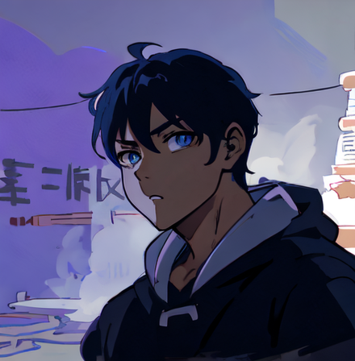

# AI Avatar Generation Server

블라인드 소개팅 서비스에서 **사용자 사진을 스타일 아바타로 변환**하는 GPU 추론 서버입니다.
GPU 서버에서 워커가 Django 작업 큐를 폴링해 작업을 가져가고, ComfyUI 파이프라인으로 이미지를 생성한 뒤 결과를 백엔드로 반환합니다.

> **모델 가중치는 이 저장소에 포함되지 않습니다.** (합계 약 69GB)
> 전량 공개 사전학습 모델이며, `models/manifest.json` + `scripts/download_models.py` 로 동일한 환경을 재구성할 수 있습니다.
> 이 저장소의 결과물은 **모델 학습이 아니라, 공개 모델·LoRA·업스케일러를 조합해 만든 추론 파이프라인과 그 서빙 구조**입니다.

---

## 1. 왜 별도 GPU 서버인가, 그리고 왜 pull 방식인가

이미지 1장 생성에 수십 초 이상 걸리므로 Django 요청-응답 안에서 처리할 수 없고, 웹 서버에 CUDA와 모델 수십 GB를 올릴 수도 없습니다. GPU 서버를 **독립 배포 단위**로 분리하고 다음 원칙으로 연동했습니다.

**Django가 GPU 서버를 호출하지 않습니다. GPU 서버가 Django를 폴링합니다.**

| | push (Django → GPU) | **pull (GPU → Django)** ← 채택 |
|---|---|---|
| 응답 지연 | HTTP 타임아웃 발생 | 즉시 `job_id` 반환, 결과는 비동기 |
| 네트워크 | GPU 서버에 인바운드 포트 개방 필요 | **outbound only** — 개발 중 GPU 머신이 사설망에 있어도 동작 |
| 장애 내성 | GPU 서버 다운 시 요청 유실 | 작업이 DB에 `pending` 으로 잔존 |
| 확장 | 로드밸런서 필요 | 워커 프로세스 추가만으로 확장 |

백엔드 주소는 배포 환경마다 달라지므로 코드에 두지 않고 `BACKEND_URL` 환경변수로 분리했습니다. 개발 단계에서는 로컬 백엔드를 터널링으로 외부에 노출해 GPU 머신에서 접근했습니다.

---

## 2. 아키텍처

```
[Vue 3]
   │  POST /api/accounts/ai/create/        (사진 + 스타일)  → job_id 즉시 반환
   │  GET  /api/accounts/ai/status/{id}/   (3초 간격 폴링)
   ▼
[Django + DRF]  ──▶ [AWS S3]  originals/ , generated/
   ▲   │
   │   │  AIJob:  pending → processing → done / failed
   │   │
   │   └── ① GET  /api/accounts/ai/next-job/         작업 선점
   └────── ② POST /api/accounts/ai/complete-upload/  결과 이미지 전송
              (outbound polling, GPU 서버에 인바운드 포트 없음)
   │
[GPU Server]
   app/worker.py            폴링 루프
     ├─ S3 원본 다운로드
     ├─ POST /upload/image           ComfyUI input 폴더로 업로드
     ├─ workflows/{style}.json 로드  → seed 랜덤화 · 입력 파일명 주입 · 프롬프트 보강
     ├─ POST /prompt                 실행 요청
     ├─ GET  /history/{prompt_id}    완료 폴링 (타임아웃 있음)
     └─ GET  /view                   결과 이미지 회수
   app/main.py              FastAPI 래퍼 — /health, /config (상태 확인용)
   │
[ComfyUI]
   SDXL · LoRA · IPAdapter FaceID · FaceDetailer · Ultimate SD Upscale
```

### 작업 상태 흐름

```
      사용자 업로드           워커 선점                워커 완료 통보
   ──────────────▶ pending ──────────▶ processing ──────────▶ done
                                          │
                                          └─ 예외 / 타임아웃 ─▶ failed (error_message)
```

---

## 3. Django ↔ 워커 API 계약

| # | 메서드 | 엔드포인트 | 요청 | 응답 |
|---|---|---|---|---|
| ① | `GET` | `/api/accounts/ai/next-job/` | — | `{"job": {"job_id", "style", "original_url"}}` · 없으면 `{"job": null}` |
| ② | `POST` | `/api/accounts/ai/complete-upload/` | `multipart` `job_id`, `result`(파일) | `{"message", "generated_url"}` |
| ②' | `POST` | `/api/accounts/ai/complete/` | `job_id`, `error` | `{"message"}` |

- ① 호출 시 Django가 해당 job을 `processing` 으로 전환합니다(중복 처리 1차 방어).
- ② 는 워커가 결과 파일을 직접 전송하고 **S3 업로드는 Django가 수행**합니다 → 워커에 AWS 자격증명을 두지 않기 위한 선택.
- 예외·타임아웃이 발생하면 반드시 ②' 로 실패를 통보해, job이 `processing` 상태로 방치되지 않게 합니다.

---

## 4. 워커 구현에서 중요한 지점

### 4-1. seed 랜덤화가 필수인 이유

```python
for node in workflow.values():
    if "seed" in node.get("inputs", {}):
        node["inputs"]["seed"] = random.randint(1, 2**32 - 1)
```

ComfyUI는 동일한 prompt 그래프를 history 캐시로 판단해 **이전 결과를 그대로 반환**합니다.
워크플로우 JSON에 저장된 seed를 그대로 쓰면 서로 다른 사용자에게 같은 이미지가 나갑니다. 매 실행마다 모든 seed 노드를 랜덤화해 해결했습니다.

### 4-2. 워크플로우 JSON은 UI 포맷이 아니라 API 포맷

ComfyUI 화면에서 저장한 JSON(`nodes` 배열 + `links`)은 `/prompt` 엔드포인트가 받지 않습니다.
**Save (API Format)** 로 내보낸, 노드 ID를 키로 갖는 dict 형태만 사용할 수 있습니다.

```
workflows/*.json              ← API 포맷 (워커가 실제로 로드)
workflows/ui/*.json           ← UI 포맷 (ComfyUI 화면에서 편집·비교용, 워커는 사용 안 함)
```

### 4-3. 노드 ID를 설정으로 분리

워커는 워크플로우의 특정 노드에 값을 주입하고 특정 노드에서 결과를 꺼냅니다. 그래프를 수정하면 노드 번호가 바뀌므로, 하드코딩하지 않고 `app/config.py` 의 `WORKFLOW_CONFIG` 로 분리했습니다.

```python
"ghibli": {
    "file": "ghibli.json",
    "load_image_node": "10",       # LoadImage      → 입력 파일명 주입
    "positive_prompt_node": "18",  # CLIPTextEncode → 성별 프롬프트 보강
    "save_image_node": "42",       # SaveImage      → 결과 이미지 추출
},
```

### 4-4. 완료 대기에 타임아웃

`/history/{prompt_id}` 폴링은 조건 없는 `while True` 로 두면 ComfyUI가 죽거나 그래프 검증에 실패했을 때 **워커가 영구히 멈추고 job도 `processing` 에 잔류**합니다.
`GENERATE_TIMEOUT`(기본 600초)을 두고, ComfyUI가 `status_str == "error"` 를 반환하면 즉시 예외로 전환해 실패 통보하도록 했습니다.

---

## 5. 스타일별 파이프라인

### 5-1. 운영 파이프라인 (워커가 실제로 사용)

| 스타일 | 워크플로우 | 베이스 | LoRA | IPAdapter FaceID |
|---|---|---|---|---|
| `ghibli` | [`workflows/ghibli.json`](workflows/ghibli.json) | `dreamshaperXL_lightningDPMSDE` (SDXL) | `giblylast` 0.8 / 0.8 | weight 0.65, lora 0.85, CUDA |
| `anime2d` | [`workflows/anime2d.json`](workflows/anime2d.json) | `dreamshaperXL_lightningDPMSDE` (SDXL) | `giblylast` 0.7 / 0.7 | weight 0.75, lora 0.6, CUDA |

```
LoadImage(원본)
 ├─ IPAdapterUnifiedLoaderFaceID (FACEID PLUS V2, provider CUDA) ─┐
 └─ VAEEncode ───────────────────────────────────────────────┐    │
                                                             ▼    ▼
CheckpointLoaderSimple  dreamshaperXL_lightningDPMSDE (SDXL Lightning)
      → LoraLoader        giblylast.safetensors
      → IPAdapterFaceID   weight_type linear, combine_embeds concat, embeds_scaling "V only"
      → KSampler          steps 25, cfg 6, dpmpp_2m_sde/karras, denoise 0.6      ← img2img
      → VAEDecode
      → FaceDetailer      face_yolov8m + SAM(vit_b), guide 768, denoise 0.3      ← 얼굴 디테일 복원
      → UltimateSDUpscale 4x-UltraSharp, ×1.2, denoise 0.15, seam_fix Linear     ← 해상도 보정
      → SaveImage (node 42)
```

**설계 근거**

| 결정 | 이유 |
|---|---|
| txt2img 대신 **img2img (denoise 0.6)** | txt2img는 원본의 구도·포즈·상반신 구성이 사라져 "내 사진"이라는 느낌이 없어짐. 구도는 유지하고 화풍만 바꾸기 위해 부분 디노이즈를 선택 |
| 베이스를 **DreamShaper XL Lightning** 으로 | 초기에는 Juggernaut-XL v9 로 실험했으나(`workflows/ui/` 참고), 사용자 대기 시간을 줄이기 위해 저스텝 계열 체크포인트로 교체 |
| **IPAdapter FaceID + LoRA 를 분리 조정** | 정체성(IPAdapter weight)과 스타일(LoRA weight)이 같은 샘플링에서 상쇄되므로, 스타일별로 두 값을 따로 튜닝. `ghibli` 는 스타일을 강하게(LoRA 0.8) / 정체성을 약하게(0.65), `anime2d` 는 그 반대(0.7 / 0.75) |
| IPAdapter provider 를 **CUDA** 로 | 초기 CPU 설정에서 InsightFace 임베딩 추출이 병목이었음 |
| **FaceDetailer** 추가 | 전신·상반신 사진은 얼굴에 할당되는 latent 해상도가 부족해 눈·입이 뭉개짐 → 얼굴만 crop해 고해상도 재생성 후 SAM 마스크로 합성. 재생성 denoise를 0.3으로 억제해 인물이 바뀌는 것을 방지 |
| 4x 업스케일러를 **×1.2 / denoise 0.15** 로 | 업스케일 단계의 디노이즈가 사실상 재생성이라 얼굴 인상이 변함. 역할을 "디테일 보정"으로 제한하고, 타일 경계는 `seam_fix Linear` + `mask_blur 8` + `tile_padding 32` 로 처리 |

### 5-2. 실험 파이프라인 — 2 스테이지 모델 체이닝

[`workflows/experimental/anime2d_2stage.json`](workflows/experimental/anime2d_2stage.json)
**구현·검증까지 완료했으나 운영에는 반영하지 않았습니다.** (생성 시간이 약 2배로 늘어 사용자 대기 시간을 감당하기 어려웠음)

```
[Stage 1]  SDXL  dreamshaperXL_lightning + IPAdapterFaceID(0.7)
           KSampler  steps 30, cfg 5, denoise 0.35
           FaceDetailer  guide 512, denoise 0.4
           UltimateSDUpscale  ×1.2, denoise 0.2
           → SaveImage node 100 "Stage1_FaceID"        ← 얼굴 정체성 확립
                      │  VAEDecode (pixel space)
                      ▼
[Stage 2]  SD1.5  meinamix_v12Final + LoraLoader(thickline_fp16, 0.6)
           VAEEncode → KSampler  steps 25, cfg 7, denoise 0.45
           → SaveImage node 300 "Stage2_Final_Anime"   ← 화풍 확립
```

**왜 두 단계로 나눴는가** — SDXL은 IPAdapter FaceID 지원으로 얼굴 정체성 보존이 강하지만, 2D 애니 화풍 LoRA 생태계는 SD1.5가 훨씬 풍부합니다. 하나의 그래프로는 두 요구를 동시에 만족시킬 수 없어 역할을 분리했고, 아키텍처가 달라 latent를 직접 넘길 수 없으므로 **`VAEDecode` → `VAEEncode` 로 픽셀 공간을 경유해 연결**했습니다.

### 5-3. 프롬프트

성별에 따라 positive 프롬프트 앞에 `1girl, beautiful detailed face` / `1boy, handsome face` 를 덧붙입니다. 이미 `1girl`·`1boy` 가 있으면 건드리지 않고, 성별 정보가 없으면 보강하지 않습니다.

| 구분 | 내용 |
|---|---|
| Ghibli (+) | `studio ghibli, AIR, hand-painted style, watercolor illustration, soft painterly texture, beautiful cinematic scenery, natural environment, ...` |
| Anime2D (+) | `anime style, beautiful detailed eyes, detailed face, perfect face, soft lighting, cel shading, vibrant colors, masterpiece, best quality` |
| 공통 (−) | `realistic, photorealistic, 3d, CGI, low quality, blurry, jpeg artifacts, bad anatomy, extra fingers, extra limbs, ugly face, deformed face, old, beard, mustache, closed eyes` |

네거티브에 `photorealistic, 3d, CGI` 를 명시해 실사로 회귀하는 현상을 억제하고, `old, beard, mustache, closed eyes` 로 프로필 사진에 부적합한 변형을 차단했습니다.

---

## 6. 결과 예시

`anime2d` 스타일 변환 결과입니다. (입력 사진은 개인 사진이라 공개하지 않습니다)



---

## 7. 모델 선정 과정

**모두 공개 사전학습 모델이며 별도 파인튜닝은 하지 않았습니다.** 스타일 재현도를 직접 비교해 조합을 확정하는 과정이 이 파이프라인의 작업 내용입니다.

- **체크포인트 13종** 비교 → 운영은 `dreamshaperXL_lightningDPMSDE`(SDXL, 저스텝), 2-스테이지 실험 2단계는 `meinamix_v12Final`(SD1.5)
- **지브리 LoRA 4종** (`giblylast`, `Ghibli_xl_v2`, `ghibli_style_offset`, `Fresh Ideas@Studio Ghibli style_SDXL`) A/B 비교 → `giblylast` 채택
- 정체성 유지: `IP-Adapter FaceID Plus V2 (SDXL)` + `InsightFace buffalo_l` 임베딩
- 얼굴 검출·세그멘테이션: `face_yolov8m.pt` + `sam_vit_b`
- 업스케일: `4x-UltraSharp`

전체 목록·용량·출처는 [`docs/MODELS.md`](docs/MODELS.md) 참고.

---

## 8. 실행 방법

### 8-1. ComfyUI 및 커스텀 노드

```bash
git clone https://github.com/comfyanonymous/ComfyUI.git
cd ComfyUI && pip install -r requirements.txt

cd custom_nodes
git clone https://github.com/ltdrdata/ComfyUI-Manager.git
git clone https://github.com/cubiq/ComfyUI_IPAdapter_plus.git
git clone https://github.com/ssitu/ComfyUI_UltimateSDUpscale.git
git clone https://github.com/ltdrdata/ComfyUI-Impact-Pack.git
git clone https://github.com/ltdrdata/ComfyUI-Impact-Subpack.git
git clone https://github.com/Kosinkadink/ComfyUI-Advanced-ControlNet.git
git clone https://github.com/sipherxyz/comfyui-art-venture.git
git clone https://github.com/jags111/efficiency-nodes-comfyui.git
```

### 8-2. 모델 다운로드

```bash
pip install huggingface_hub requests
python scripts/download_models.py --comfy-root /path/to/ComfyUI
```

### 8-3. ComfyUI 실행

```bash
# 모델을 상시 로드해 두어 콜드 스타트를 제거
python main.py --listen 127.0.0.1 --port 8188
```

### 8-4. 워커 실행

```bash
cd ai
pip install -r requirements.txt
cp .env.example .env      # BACKEND_URL, COMFYUI_URL 설정

# (A) 워커만 실행
python -m app.worker

# (B) FastAPI 래퍼와 함께 실행 — /health, /config 로 상태 확인 가능
uvicorn app.main:app --host 0.0.0.0 --port 8000
```

### 8-5. 백엔드 없이 파이프라인만 확인

```bash
# ComfyUI input/ 폴더에 이미지를 두고 파일명을 지정
python scripts/run_local.py --style ghibli --image sample.jpg --out result.png
```

### 8-6. 환경변수

| 키 | 설명 | 기본값 |
|---|---|---|
| `BACKEND_URL` | Django 백엔드 베이스 URL | — (필수) |
| `COMFYUI_URL` | ComfyUI HTTP API | `http://127.0.0.1:8188` |
| `WORKER_TOKEN` | 워커 인증 토큰 (`X-Worker-Token`) | 없음 |
| `POLL_INTERVAL` | 작업 없을 때 폴링 주기(초) | `3` |
| `ERROR_BACKOFF` | 폴링 실패 후 재시도 대기(초) | `5` |
| `GENERATE_TIMEOUT` | 생성 1건 최대 대기(초) | `600` |
| `HTTP_TIMEOUT` | HTTP 요청 타임아웃(초) | `60` |
| `WORKFLOW_DIR` | 워크플로우 JSON 경로 | `./workflows` |

---

## 9. 디렉터리 구조

```
ai/
├── app/
│   ├── config.py            환경변수 · 스타일별 워크플로우/노드 매핑
│   ├── worker.py            폴링 루프 · ComfyUI 실행 · 결과 반환
│   └── main.py              FastAPI 래퍼 (/health, /config)
├── workflows/
│   ├── ghibli.json          운영 (API 포맷)
│   ├── anime2d.json         운영 (API 포맷)
│   ├── experimental/
│   │   └── anime2d_2stage.json   SDXL→SD1.5 2단계 (검증 완료, 미배포)
│   └── ui/                  ComfyUI 화면 편집용 (UI 포맷, 워커 미사용)
├── models/manifest.json     모델 목록 · 경로 · 출처 (가중치는 미포함)
├── scripts/
│   ├── download_models.py   manifest 기반 모델 일괄 다운로드
│   └── run_local.py         백엔드 없이 파이프라인 단독 검증
├── docs/
│   ├── MODELS.md            모델 상세 목록과 선정 근거
│   └── images/              변환 전/후 샘플
├── requirements.txt
├── .env.example
└── .gitignore
```

---

## 10. 알려진 한계 및 개선 계획

| 한계 | 개선 방향 |
|---|---|
| Django 워커 엔드포인트가 인증 없이 공개 (`AllowAny`) | 워커가 보내는 `X-Worker-Token` 을 백엔드에서 검증하도록 추가 (워커 측은 구현 완료) |
| 작업 선점이 비원자적 (`filter().first()` → `save()`) → 워커 2대 이상이면 중복 처리 가능 | `select_for_update(skip_locked=True)` 트랜잭션 또는 Celery + Redis 브로커 |
| 백엔드가 `gender` 를 내려주지 않아 성별 프롬프트 보강이 사실상 비활성 | `NextJobAPIView` 응답에 `user.gender` 추가 |
| `pixar` · `zepeto` 스타일은 Django `STYLE_CHOICES` 에만 있고 전용 워크플로우 미구현 | 워크플로우 추가 (현재는 기본 스타일로 대체되며 로그로 남음) |
| 유저·워커 양쪽 폴링으로 불필요한 요청 발생 | 기존 Django Channels 재사용해 WebSocket 푸시 또는 SSE |
| 워커가 처리 중 죽으면 job이 `processing` 에 잔류 | 워커 측 타임아웃은 처리했으나, 백엔드에도 `updated_at` 기반 재큐잉 필요 |
| 2-스테이지 파이프라인이 품질은 좋으나 생성 시간 2배 | 유료 옵션으로 분리하거나 저스텝 스케줄러로 단축 |
| 스타일 파라미터가 워크플로우 JSON에 하드코딩 | 프리셋을 설정으로 분리해 A/B 테스트 가능하게 |
